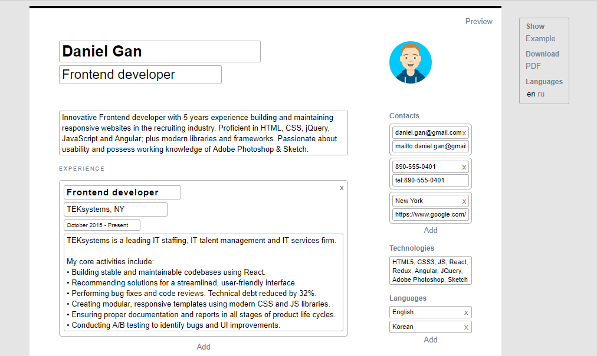

# CV editor

Simple and easy CV editor: `write` -> `download` -> `send to a HR` -> `receive a dream offer`.



# Features

🔽 **Download in PDF**

You can download your CV in a PDF format. To do this, use `PDF` button on the toolbar.

💾 **Auto saving in a browser**

You can finish your CV later. All changes in your CV are automatically saved in your browser (in localstorage).

👀 **Look an example**

You can see a CV example. To see one, use `example` button on the toolbar.

👌 **Supporting English and Russian langs**

You can make CV with English or Russian section titles. To toggle language, use `en` or `ru` buttons on the toolbar.

🔗 **Use md refs in your text**

You can add a ref in your text. To do this, use md ref syntax directly in any multiline text input field. For example, `[My GitHub profile](https://github.com/yurimikushov)` will convert to [My GitHub profile](https://github.com/yurimikushov).

# For developers

Installs the project

```
git clone https://github.com/yurimikushov/cv-editor.git
cd cv-editor
npm i
```

Checks a follow CSS writing conventions

```
npm run stylelint
```

Checks a follow JS writing conventions

```
npm run eslint
```

Runs the app in `development` mode on `localhost:3000`

```
npm start
```

Builds the app for `production` to the `build` folder

```
npm build
```

# License

The project is available under the [MIT License](LICENSE).
